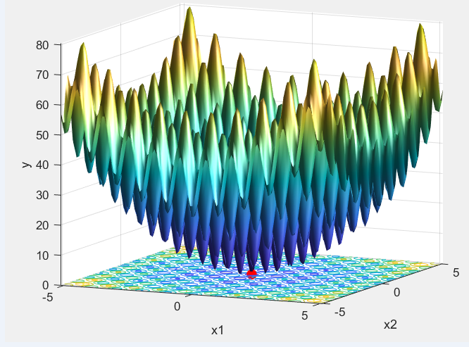

<b><h2>Task 1</h2></b>

Using the matlab script you can find the optimal solution for the defined problems for the following metaheuristics:
- Genetic Algorithm
- Simulated Annealing

Defined problems:
- De Jong Function No.5
- Rastrigin's function
- Rosenbrock function

## Images

<b>Found optimal solutions for defined problems using Genetic Algorithm: </b>

<b>De Jong Function No.5  </b>

 

<b>Rosenbrock function</b>

 

<b>Rastrigin's function</b>

