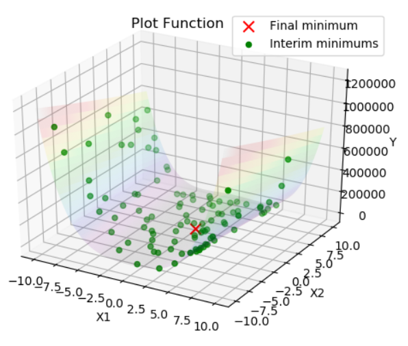
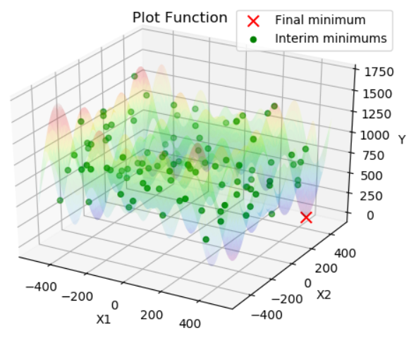

<b><h2>Task 3</h2></b>

Using the python script you can find the optimal solution for the defined problems for the following metaheuristics:
- Bat algorithm

Defined problems:
- Rastrigin's function
- Rosenbrock function
- Schwefel function:

## Images

<b>Found optimal solutions for defined problems using Bat Algorithm: </b>

<b>Rastrigin's function</b>

 

<b>Rosenbrock function</b>

 

<b>Schwefel function</b>

